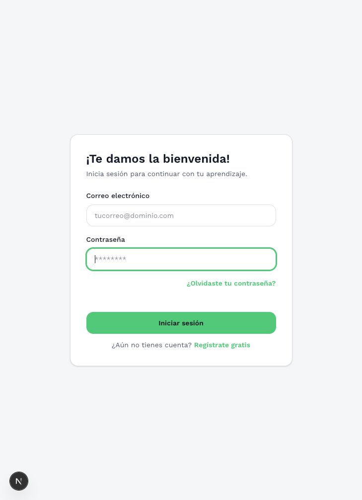
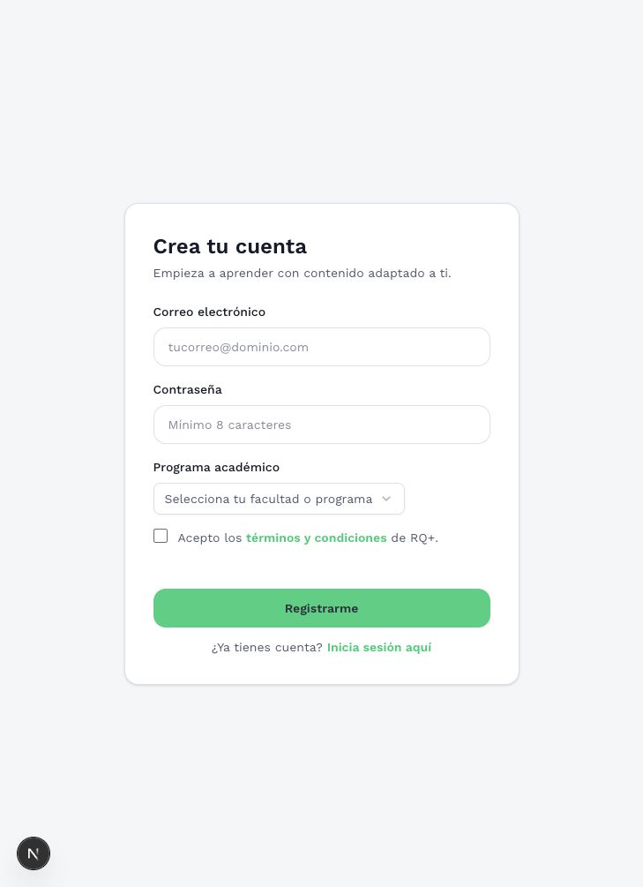

# RQ+ migration and interface review

Date: 2026-09-07. Source: `main`, commit `5f55bccf046c9dc76cda3df9a1d2af320fb223aa`.

## Recommendation

Keep Next.js and TypeScript. Move application data, backend business operations, uploaded files, and scheduled work to the existing Convex project. Use Better Auth through the Convex-maintained integration for conventional email/password authentication, with its account/session data stored in Convex. Keep Vercel as the frontend host once access to the existing project is resolved.

This is an architectural migration and an exam reliability improvement, not simply replacing Prisma calls. Preserve the educational rules with explicit tests, correct identified defects, then redesign the student journey around a clear next action.

This document is the analysis deliverable. Application code and cloud configuration have not been changed. No production data was read or migrated.

## Completion criteria

The analysis is complete when the current stack and relevant behavior are inspected, deployment evidence is classified, an implementable target architecture is defined, and migration risks and acceptance checks are documented.

The implementation will be complete only when:

- Email/password registration, login, logout, recovery, and session expiry work against the intended Convex deployment.
- Existing records selected for preservation reconcile by counts, identities, references, scores, and file checksums.
- Entry assessment, placement, training, exit eligibility, and results pass defined business-rule tests.
- An acknowledged answer survives refresh and another-device login; pending writes are never displayed as saved.
- Scoring, deadlines, ownership, and question membership are enforced by the backend.
- Desktop/mobile and keyboard checks pass for the core journey, alongside measured performance budgets.
- The deployed Vercel alias is verified against the intended code and Convex backend, with rollback rehearsed.

## What is confirmed

| Item | Evidence | Meaning |
|---|---|---|
| Application | Next.js 15.5.9, React 19.1.0, TypeScript 5, Tailwind 4, shadcn/Radix | Existing foundation can be retained |
| Persistence | PostgreSQL and Prisma; 14 models in `prisma/schema.prisma` | Relational constraints and joins need deliberate replacements |
| Backend | Seven service modules; 1,735 lines combined | Existing rules are concentrated enough to extract and test |
| Exam client | `src/view-models/exam/use-exam-vm.ts`, 804 lines | State, persistence, timing, hints, and API coordination are coupled |
| Files | Vercel Blob for profile photos; bundled question images in `public/` | Migration must cover both sources plus URLs embedded in Markdown |
| AI | OpenAI Responses API, model configured as `gpt-5-mini-2025-08-07` | Preserve provider initially; migrate execution and persistence |
| Email | `src/lib/email.ts` only logs a simulated message | Password recovery is not a completed email-delivery integration |
| Convex | Browser shows `rq_math_lasalle`, development `gallant-cricket-31`, zero recorded usage | Use this existing development target; do not create another project |
| Convex deployment | User-supplied Health snapshot says “Never deployed” | Creating the project did not connect the app or migrate anything |
| Vercel | GitHub deployment 4054643531, Production, success on 2026-03-12, same source SHA | Historical successful deployment is confirmed |
| Vercel ownership/access | Deployment points to `la-salles-projects/math-app`; connected account returns 403, browser shows Not Found | Current access and production alias are unresolved |

Vercel evidence: [deployment overview](https://vercel.com/la-salles-projects/math-app/EPVnfz6oh8WiZhSbvyFPqDCDuJXS). Its immutable application URL redirects to Vercel access protection. This is not proof that the present public application is healthy, offline, or deleted.

No database credentials were present in the checkout. Current user counts, real question counts, storage inventory, active assessments, and actual PostgreSQL host remain unverified. Repository content is a potential seed source, not an authoritative production snapshot.

## Current behavior that must survive

The student registers, completes a profile, takes an entry assessment, receives a training plan, answers enough distinct plan questions to unlock the exit assessment, and views results. Training is untimed; entry and exit use the configured assessment duration. Training can be repeated. Entry and exit completion gates are present.

The import script defines three categories: Interpretación, questions 1–12; Formulación, 13–23; Argumentación, 24–35. Its thresholds use 0–4 for LOW, 5–8 for MEDIUM, and 9 through the category maximum for HIGH. These are source-defined rules and must be reconciled against production configuration before migration. Test all 27 LOW/MEDIUM/HIGH combinations against the placement rules; do not invent a fallback plan.

Exit eligibility currently counts distinct answered questions across training attempts, not just correct answers. Keep that rule unless explicitly changed. AI assistance currently generates a related worked example for training and refuses image-based questions. Multimodal tutoring would be a separate product change.

## Defects and risks found in source

These are source findings, not claims of a production exploit or a measured production failure.

| Priority | Finding | Evidence and impact | Required change |
|---|---|---|---|
| High | Inconsistent training percentage | `exam-attempt-service.ts:531` divides by every question in the bank; results page uses the assigned plan count | Score against the attempt's frozen question set. Example: 10 correct out of a 20-question plan must not use a 150-question denominator |
| High | Missing exam/plan membership validation | `saveAnswer`, line 458, checks attempt ownership and option-to-question relation, but not question-to-attempt membership | Reject questions outside the assigned version and plan in the mutation |
| High | Correctness exposed while answering | `saveAnswer` returns `isCorrect` for every attempt kind | Hide answer keys/correctness during entry/exit; release feedback according to assessment policy |
| High | Failed save can appear successful | Answer route returns a JSON failure with HTTP 200; client lines 428–440 checks only HTTP status | Use typed outcomes and a visible acknowledged-save state |
| High | Deadline is browser-controlled | Timer increments locally; submit accepts client `timeSpent`; write operations do not enforce a server deadline | Persist `startedAt`/`deadlineAt`; enforce on every save and submit |
| High | Start restrictions can be bypassed through generic mode | Start route accepts/defaults to GENERIC and its service fallback creates an unrestricted attempt | Derive permitted modes from the exam on the backend; remove public generic fallback for restricted assessments |
| Medium | Concurrent selections and submit can race | Client abort does not cancel an already-running database write; submit does not await pending answer saves | Define revisions/idempotency and a flush-before-submit protocol |
| Medium | Recovery depends heavily on browser state | Local storage key uses slug and mode; validation failures, including network failures, clear it | Server canonical progress; local pending outbox scoped to user + attempt, preserving network-failure drafts |
| Medium | Start checks and creation are separate | Active-attempt checks and creation are not one transaction | Perform authorization, eligibility, and create-or-resume atomically |
| Medium | Progress logic is duplicated | Training summary and attempt service separately compute distinct answered questions | Centralize the rule and maintain a transactional progress summary |
| Medium | AI generation can duplicate work | Cache check precedes an external call without an atomic claim | Reserve a unique job, rate-limit, persist status, and guard completion by job identity |
| Medium | Current seeds can replace linked data | Scripts delete options and plan-question mappings | Versioned, idempotent import with validation, dry run, and stable identity mapping |

Historical stored scores should be preserved as historical evidence. Any recalculated score should be separate and labeled with a scoring version; do not silently rewrite student history while fixing future scoring.

## Authentication decision

Prefer **Better Auth + `@convex-dev/better-auth`**. It supports the requested email/password UX and has a documented Next.js integration for cookies, server rendering, and authenticated Convex calls. Authentication data remains in the Convex component; Better Auth is a library integration, not another hosted identity account that students must use. [Official Next.js integration](https://labs.convex.dev/better-auth/framework-guides/next).

Convex Auth's Password provider is a valid alternative. However, Convex currently labels Convex Auth beta and describes its Next.js server-component/API/middleware support as experimental. That makes Better Auth the preferred candidate for this existing App Router app, subject to a small integration proof. [Convex Auth status](https://docs.convex.dev/auth/convex-auth), [password support](https://labs.convex.dev/auth/config/passwords).

Use the adapter's supported Better Auth version range, not independently chosen latest packages. The official integration guide currently pins Better Auth to `~1.6.15`; verify the compatibility range again at implementation time.

The proof must exercise signup, login, authenticated server rendering, a protected query/mutation, token refresh, logout, and recovery. Keep app profile/role fields in a separate domain table linked to the auth component's user identity. Never let clients assign teacher privileges. Route guards improve navigation; every Convex function still performs its own authorization.

Current passwords use Node scrypt with a binary salt and `saltHex:hashHex` serialization. The same algorithm name does not establish compatibility with Better Auth defaults. Better Auth exposes custom hashing/verification hooks. A migration adapter is feasible only after testing generated legacy fixtures, Unicode handling, malformed hashes, runtime support, and resource costs. Do not copy Node `scryptSync` into a Convex mutation. [Better Auth password configuration](https://better-auth.com/docs/authentication/email-password).

Two migration paths remain open:

1. Preserve credentials with a tested legacy verifier and controlled upgrade to the chosen new format after successful authentication. This needs explicit implementation of the upgrade; it is not assumed automatic.
2. Preserve identities and results, but require a password reset at first access. This needs a working sender and user communication before cutover.

In either case, old JWT cookies are retired and students sign in again. Never migrate active reset codes or old sessions. Email normalization conflicts must be reported for resolution, not automatically merged. Existing unverified addresses must not become verified simply because they were imported.

Recovery and optional email verification require an actual email delivery service. Reuse the institution's existing sender if available; otherwise choose one separately. Convex handles the scheduling and backend workflow, but is not itself the mailbox-delivery provider. OpenAI remains the existing AI provider as well.

## Target data and backend design

| Domain | Convex representation | Main access paths |
|---|---|---|
| Identity | Better Auth component; `profiles` for role, program, onboarding, photo storage ID, legacy UUID | Auth-user ID; legacy ID |
| Catalog | `exams`, immutable `examVersions`, `questions` with small embedded choices | Slug; exam version + order; legacy ID |
| Answer keys | Server-only grading records or explicit server-only projections | Question/version ID |
| Rules | `trainingPlans`, `planQuestions`, category definitions/thresholds, `placementRules` | Plan/version + order; exam version + three levels |
| Attempts | `attempts` with owner, kind, state, frozen version/assigned set, deadline, scoring version | Owner + status; owner + kind; legacy ID |
| Answers | `responses`, one per attempt/question, selected option, revision, server timestamp | Attempt + question; attempt |
| Learning progress | `placements`, unique answered-question records, `trainingProgress` summary | Owner + plan + question; owner + plan |
| Assistance | `aidUsages`, `aiJobs` with pending/running/ready/failed status | Attempt + question + aid |
| Files | `_storage` IDs plus owned asset metadata and source mappings | Owner/type; legacy path/checksum |
| Migration | Batch ledger, legacy-to-Convex ID maps, validation reports | Import batch + source ID |

The exact schema should be driven by the query inventory. Do not mechanically create fourteen SQL-shaped collections and reproduce every join. Use small embedded values where read together, and separate unbounded history. Convex indexes are not SQL foreign-key or uniqueness declarations: enforce reference validity and logical uniqueness transactionally. Cascading deletion must be explicit. [Convex query and index practices](https://docs.convex.dev/understanding/best-practices).

Use public queries for minimal student-safe projections; mutations for start/resume, answer, submission, and profile changes; actions for OpenAI and external email; internal functions for grading, imports, jobs, and cleanup. Derive ownership from the authenticated identity, never a caller-provided user ID. Every function gets argument/return validators.

Keep the useful existing separation of views and business logic, but split the 804-line exam hook into narrowly scoped pieces for presentation, answer queue, navigation, timer, and assistance. Extract grading and eligibility into pure functions shared by tested backend handlers. Remove Prisma, old JWT utilities, REST wrappers that merely proxy CRUD, and `@vercel/blob` after the new paths pass acceptance.

### Answer and timer protocol

1. Start/resume runs atomically and returns the attempt ID, immutable assessment version, deadline, and canonical saved progress.
2. Selecting an answer updates local UI immediately, marks it pending, and sends a mutation with a stable operation identifier/revision.
3. The mutation checks identity, attempt state/deadline, question membership, and selected option validity. It writes the answer and progress once. Acknowledgment changes the UI to saved.
4. Submission first waits for pending saves. The server then finalizes the attempt idempotently, computes the result against the assigned set, and applies placement/progress rules in the transaction where practical.
5. Large workloads use bounded batches and an explicit finalizing state. Do not pretend a sequence of separate actions is atomic.
6. A scheduled expiry closes timed attempts even when the browser is shut. Every mutation independently checks the deadline so scheduler delay cannot extend an exam. The UI countdown uses server time/deadline rather than tick counts.

Convex reconnect/retry behavior does not replace a durable offline outbox. Persist only pending changes locally, scoped to user and attempt, and make retry/conflict states visible. Multi-tab/device conflicts need a declared policy, such as rejecting stale revisions and reloading current state. Never silently replay stale answers over newer work. Clarify whether assessment time continues while closed; wall-clock deadlines are the proposed policy, not an inferred existing requirement.

### Files and assistance

Upload photos directly to Convex through an authenticated upload-URL operation, then finalize ownership and validate size/type from stored metadata. Keep storage IDs in domain records and resolve delivery URLs when reading. Private assets need an authorization-aware serving design; possession of a storage URL must not be mistaken for per-request access control. [Uploading](https://docs.convex.dev/file-storage/upload-files), [serving](https://docs.convex.dev/file-storage/serve-files).

Import Vercel Blob photos and question media with checksums, type, size, and a source-to-storage-ID map. Rewrite both choice image URLs and Markdown/HTML image references. Keep presentation icons and CSS as application code; student and instructional assets belong in Convex. Reuse of bundled branding is a build concern rather than a second user-data store.

Preserve the current training-only AI behavior. Move request ownership, job state, caching, limits, and provider credentials to Convex. Evaluate the Agent component for managed generation if it fits this single-example use case; do not expand the product into chat merely to adopt a component. Retry only with a bounded policy: application deduplication cannot guarantee an external provider never processes a duplicate after an ambiguous timeout.

## Interface review and proposed changes

Visual inspection covers the local public auth forms at the original source SHA, not authenticated production. Screenshots below are 729 × 1005. No successful signup/login or email request was submitted.

### Step 1 — Login: usable basic structure, weak product identity

Fields are labeled and the primary action is clear. The form has no visible RQ+/La Salle identity, password visibility control, or persistent inline error region. Small green recovery/registration links need contrast verification and likely a darker text token. Keep the green accent for appropriate surfaces, add clear branding, accessible field errors, and password visibility. Password-manager autocomplete is already configured and should remain.

### Step 2 — Registration: understandable, incomplete supporting flow

The academic-program selector is visually narrower than the text inputs. Its list is not searchable in the current form. The terms link points to `#`, so it does not open actual terms. The required consent checkbox should lead to real approved content. Add a full-width searchable program selector, upfront password guidance, and field-level errors. Avoid collecting the same program information twice during onboarding.

### Step 3 — Dashboard, assessment, results: visual audit blocked

Protected screens require a configured database and authenticated test account. Their behavior was reviewed in source only; no claim of visual or accessibility validation is made.

Proposed student journey:

- **Dashboard:** lead with “Continue your assessment” or “Continue training,” showing actual progress and the next required step. Move account status and consent metadata out of the main learning area. Current code gives these metadata cards prominent space.
- **Onboarding:** short profile step, optional photo, clear assessment explanation. Keep the interface in Spanish and preserve RQ+/La Salle identity.
- **Assessment:** legible question column, accessible single-choice controls, stable timer and save status, question navigator, answered/unanswered/flagged states, and review-before-submit. Skipping questions is a proposed behavior change: the current Next button generally requires an answer.
- **Training:** show the assigned plan, distinct answered count, remaining threshold, and progressively revealed help. Prefer a side panel or mobile drawer over disruptive overlays for long explanations.
- **Results:** separate correct, incorrect, and unanswered counts; explain competency levels and next action; compare entry/exit only where the assessment versions remain comparable.
- **Accessibility:** visible keyboard focus, radio-group semantics, accessible dialogs with focus restoration, reduced motion, sufficient contrast, text alternatives and usable math, and mobile overflow checks. Existing custom dialogs need focus behavior testing; ARIA attributes alone do not prove accessibility.

No teacher dashboard implementation was found despite the TEACHER enum. A new teacher administration/reporting product should be scoped separately rather than assumed part of this migration.

## Performance plan and baseline

Baseline commands were run against the unmodified application:

| Check | Result |
|---|---|
| `npm ci --ignore-scripts --no-audit --no-fund` | Passed |
| `npx prisma generate` | Passed |
| `npx tsc --noEmit --incremental false` | Passed |
| `npx eslint src` | Passed |
| `npm run lint` | Failed: 32 errors, 9 warnings in import/seed scripts |
| `npm run build` | Passed; 21 static pages generated |
| Public auth screens | Rendered locally and captured |
| Database flows, AI, delivery, deployed app | Not exercised |

Next build reports first-load JS of 134 kB for login, 163 kB for registration, 131 kB for dashboard, and 322 kB for the exam route (199 kB route size). These are build outputs, not real-user load timings or an attribution profile.

Priorities:

1. Profile the exam bundle; lazy-load help/AI UI and heavy content utilities when needed. Keep KaTeX and Markdown functionality but avoid loading exam-only styling across auth pages where feasible. KaTeX CSS is currently imported globally in two places; bundling may deduplicate it, so do not claim doubled download without measurement.
2. Fetch current question content and a small adjacent prefetch window; keep navigation metadata separate. Never subscribe to the full question bank plus all changing responses in one large query.
3. Preload essential authenticated data through Next.js server rendering, then use narrow reactive subscriptions. Remove manual dashboard-refresh flags when the reactive path replaces them.
4. Cache immutable/versioned instructional content. Maintain per-student progress summaries transactionally instead of rescanning all historical responses on every dashboard refresh.
5. Optimize images with explicit dimensions and appropriate sizes; memoize expensive math rendering only after profiling. Isolate countdown rerenders from question rendering. No per-second database writes for a visible timer.

Proposed acceptance targets: LCP ≤2.5 seconds, INP ≤200 ms, CLS ≤0.1 on the agreed device/network profile; local answer selection feedback ≤100 ms; at least 30% less exam first-load JS using comparable build measurements, subject to profiling the new auth/client baseline. These are targets, not achieved results. Test backend load at the expected simultaneous class size plus headroom; that class size is still unknown. Measure subscription fan-out, mutation latency, conflicts, file egress, and AI cost before promising savings.

## Migration sequence

1. **Inventory and freeze the rules.** Resolve Vercel ownership/public URL, identify the source DB and file inventory, count records, inventory active attempts, and select the authoritative question/rule sources. Preserve everything by default until the data-retention decision is confirmed.
2. **Authentication proof in development.** Link only to existing `gallant-cricket-31`, pin compatible dependencies, complete the auth proof, and validate credential migration fixtures. This step does not require production data.
3. **Catalog and domain functions.** Import a representative non-sensitive fixture, implement versioned questions, transactional attempt/answer/submission, placement, and training progress. Compare expected educational results before rebuilding every screen.
4. **Redesign the core flow.** Establish shared tokens/components and build login/onboarding, dashboard, assessment, and results. Validate desktop, narrow mobile, keyboard, slow network, reload, and concurrent tabs.
5. **Storage, assistance, and recovery.** Move asset references, AI actions, and email scheduling; verify actual file read-back and authorized end-to-end delivery in a test workflow.
6. **Migration rehearsal.** Take a source export with a timestamp, transform into bounded JSON/JSONL batches, establish a source-ID map, then import references in dependency order. Auth component records require supported component APIs/schema handling, not arbitrary writes into its private tables. Run count, uniqueness, orphan, score, media, and ownership reconciliation. [Convex data import](https://docs.convex.dev/database/import-export/import).
7. **Controlled production cutover.** Create/identify a separate Convex production deployment in the existing project. Resolve or drain active exams; freeze old writes briefly, take a final export/delta, rerun reconciliation, then switch the verified frontend. Avoid indefinite dual writing because PostgreSQL and Convex cannot share one atomic transaction.
8. **Retire the old backend after acceptance.** Keep the old DB and files recoverable for the agreed retention window. Remove runtime dependence on Prisma/PostgreSQL/Vercel Blob and the old auth once read-back and recovery checks pass.

The repository seed files may be enough for a fresh environment, but they cannot reconstruct existing users, answers, or uploaded photos. Do not run their destructive replacement routines against production as a shortcut.

## Vercel and deployment design

Use the existing Vercel project if its owners grant the required access. Do not create a duplicate or transfer ownership simply because the current connector has no access. `gallant-cricket-31` is a development backend, not the production destination.

Keep Development, Preview, and Production environment mappings explicit. Production deploy keys must not be available to previews. Configure the auth site URL, allowed origins, cookies, Convex cloud/site URLs, and secrets per environment. The official Vercel integration supports coordinated builds and separate preview backends; adopt previews only after confirming availability and budget. [Convex on Vercel](https://docs.convex.dev/production/hosting/vercel).

Upgrade Next.js/React to a currently supported, patched compatible combination in an isolated step with its own checks. Staying on Next.js does not require keeping the exact old version. Do not combine an unnecessary framework redesign with the data migration.

Rollback before new writes is a frontend/backend routing reversal against preserved data. Rollback after Convex accepts real student writes requires reconciling those writes back or a forward fix; simply restoring the old frontend would lose continuity. Rehearse both cases.

## Required verification matrix

| Area | Cases |
|---|---|
| Auth | New and legacy fixture login; wrong password; Unicode; refresh; logout; expiry; reset-token reuse; account isolation; role tampering |
| Exams | Start/resume; duplicate start; entry/exit gates; invalid mode; out-of-plan question; invalid option; answer-key visibility |
| Save reliability | Rapid answer changes; lost connection; refresh with pending change; multiple tabs; conflicting device write; immediate submit after selection |
| Time | Deadline boundary; sleeping tab; clock adjustment; closed browser; scheduler delay; late mutation; untimed training |
| Scoring | Assigned denominator; unanswered counts; three category boundaries; all 27 placement combinations; repeated submit; historical score/version preservation |
| Training | Distinct answered count across attempts; changing an answer does not add progress; exact unlock threshold; inactive/versioned plans |
| Files | Oversize/type rejection; ownership; duplicate import; orphan cleanup; broken Markdown paths; public/private serving |
| AI | Training-only authorization; image restriction preserved; duplicate request; timeout; failed provider response; bounded retries; correct persisted result |
| Migration | Batch restart; duplicate IDs; email conflicts; missing parent; rejected rows; count/reference/checksum reconciliation; rollback |
| UI/performance | 360/390 px mobile and desktop; keyboard/screen-reader pass; contrast; error/pending states; representative class load; comparable bundle and browser metrics |

Use a small set of domain fixtures and real Convex integration checks, plus browser tests for the critical journey. Avoid tests that merely restate implementation. Every claim of migration success must include read-back from the chosen destination.

## Open decisions

- Preserve all users/results, or only instructional catalog and plans? The safe working assumption is preserve all; no deletion is authorized by this analysis.
- What is the current public URL, and which account controls the `la-salles-projects` Vercel project?
- Which database and email sender are currently available, and what are the expected concurrent class size and device/network constraints?
- Must current passwords continue working, and should timed exams continue counting while closed? Recommend preserving passwords only with a proven compatibility path and using server wall-clock deadlines for timed assessments.

These gaps do not prevent architecture and local development planning. They do prevent claiming a complete production migration or authorizing a destructive cutover.
